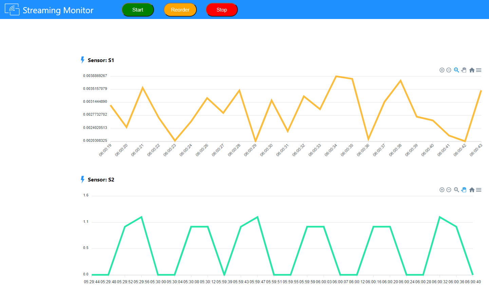

# realtime-streaming-demo
Realtime Streaming Data Visualisation Demo built on simulated data.
Useful to see streaming in action for Edge deployment use cases.

WSL 2.0 
Ubuntu 18.04
SQL Server
REACT
Node 

### Output

## Setup

### Clone
Clone this repo.

### Setup Node
Install node and packages. See package.json
  
### Setup REACT
Install REACT and Packages. See package.json
  
## Setup SQL Server
- Create SQL Database, Table, Stored Procedures.
- Run procedure to simulate sensor readings.
  
## Run the demo
### Run Node App
node server.js

### Run React App
npm start

### Run Sensor Reading Generation
Run the stored procedure (1 per sensor, multiple query windows.)